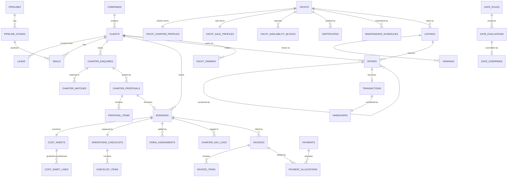

# 03 · Data Model / ERD

MySQL 8, InnoDB, `utf8mb4_0900_ai_ci`. 112 tables across nine domains.

Tables the master prompt named are marked ✔. Tables added during modelling are marked ➕ with the reason — none of them are speculative; each exists because a named requirement has nowhere else to live.

---

## 0 · Conventions applied to every business table

| Rule | Detail |
|---|---|
| Key | `id` BIGINT UNSIGNED AUTO_INCREMENT |
| Timestamps | `created_at`, `updated_at` UTC (D-010) |
| Deletion | `deleted_at` — soft deletes everywhere, archive not erase (D-008) |
| Attribution | `created_by`, `updated_by` → `users.id` |
| Audit | `owen-it/laravel-auditing` on every model in this document |
| Ownership | `assigned_user_id` on client-facing records, enforced by the `ScopedToOwner` global scope (D-017) |
| Money | `decimal(15,2)` + `*_currency` char(3) where variable; AED implicit otherwise (D-002) |
| Human ID | `reference` varchar(32) UNIQUE, issued by `SequenceService` (D-013) |
| Encryption | Laravel `encrypted` cast + `*_hash` blind index where searchable (D-007) |
| Status | `status` varchar(32) backed by a PHP enum; never a free string |
| Uniqueness | Composite with `deleted_at` where a value must be reusable after archiving |
| Indexes | Every FK indexed; every polymorphic pair indexed as `(subject_type, subject_id)`; every `status` + `assigned_user_id` combination that backs a board or a list view |

---

## 1 · Identity and access

| Table | Key columns | Notes |
|---|---|---|
| `users` ✔ | name, email UNIQUE, password, avatar_path, phone, locale (en/ar), timezone, `two_factor_secret` (enc), `two_factor_recovery_codes` (enc), `two_factor_confirmed_at`, business_line_access JSON, is_active, last_login_at, last_login_ip | 2FA mandatory: middleware blocks every route but enrolment until `two_factor_confirmed_at` is set |
| `roles` ✔ / `permissions` ✔ / `model_has_roles` / `model_has_permissions` / `role_has_permissions` | spatie schema | Four roles; see `05-permissions.md` |
| `teams` ➕ | name, lead_user_id | Needed for "Sales sees own clients" to also mean "a team lead sees the team's" (Q2) |
| `team_user` ➕ | team_id, user_id, role_in_team | |
| `sessions` ✔ | Laravel session table + user_id, ip_address, user_agent, last_activity | Backs the concurrent-session list and revoke |
| `password_histories` ➕ | user_id, password_hash, created_at | Prevents reuse of the last 5; part of the 12-char policy |
| `user_preferences` ➕ | user_id, key, value JSON | Saved table columns, density, default filters |
| `saved_views` ➕ | user_id, module, name, filters JSON, columns JSON, is_shared | The Filter control on every index screen persists here |

---

## 2 · CRM core

### `clients` ✔ — the single client record
| Column | Type | Notes |
|---|---|---|
| reference | varchar(32) UNIQUE | `CL-2026-0041` |
| client_type | JSON | `["charter_guest","buyer","owner"]` — one record can be all of them |
| salutation, first_name, last_name, full_name | varchar | `full_name` generated column for search |
| full_name_ar | varchar | Arabic name, searchable |
| company_id | FK → companies NULL | |
| email, mobile, phone_alt | varchar | `mobile` E.164, indexed |
| preferred_channel | enum | whatsapp / email / phone / agent |
| nationality, country_id, address_line1/2, city, emirate | varchar | |
| date_of_birth | date NULL | |
| passport_number | text ENCRYPTED | + `passport_hash` blind index |
| emirates_id | text ENCRYPTED | + `emirates_id_hash` |
| trn | text ENCRYPTED | |
| vip_level | enum | none / vip / uhnw / protected — `protected` requires `clients.view-vip` |
| dietary_preferences, allergies | text ENCRYPTED | Field-level gated |
| notes_vip | text ENCRYPTED | |
| source_id | FK → lead_sources | |
| assigned_user_id | FK → users | Drives the ownership scope |
| kyc_status | enum | not_started / pending / verified / rejected / expired |
| kyc_verified_at, kyc_verified_by | | Feeds the contract-generation gate |
| aml_status, aml_screened_at | | Feeds the brokerage AML gate |
| marketing_consent_at, consent_channel | | |
| status | enum | active / dormant / blacklisted |

Access to any `protected`/`uhnw` record writes a `record_access_logs` row (§9).

| Table | Key columns | Notes |
|---|---|---|
| `client_contacts` ➕ | client_id, name, role, email, mobile, is_primary | PAs, family offices and captains contact us, not the principal |
| `companies` ✔ | reference, legal_name, trade_name, type (corporate/DMC/concierge/charter_partner/broker), trn (enc), trade_licence_no, licence_expiry, address, country, billing_email, payment_terms_days, commission_rate_default, status | |
| `company_contacts` ➕ | company_id, client_id NULL, name, position, email, mobile | |
| `lead_sources` ➕ | name, channel, is_active, utm_key | The brief requires source reporting; a lookup beats a free string |
| `leads` ✔ | reference, business_line (charter/brokerage/management), source_id, client_id NULL, company_id NULL, name, email, mobile, message, status (new/contacted/qualified/registered/unqualified/duplicate), assigned_user_id, duplicate_of_id, duplicate_score, duplicate_checked_at, first_response_at, sla_due_at, converted_at, converted_to_type/id | `first_response_at` + `sla_due_at` back the Follow-Up Pool and response-time reporting |
| `pipelines` ➕ | key (charter/buyer/seller), name, is_active | Stage lists are configurable in Settings, per the brief |
| `pipeline_stages` ➕ | pipeline_id, key, name, name_ar, sort_order, colour_token, is_won, is_lost, probability | Colour is a status token, never a hex |
| `deals` ➕ (D-005) | reference, pipeline_id, stage_id, client_id, subject_type/subject_id (enquiry, listing, buyer requirement), yacht_id NULL, value, currency, expected_close_date, assigned_user_id, stage_entered_at, lost_reason_id, status | One board, three pipelines. The gate engine guards stage moves here |
| `lost_reasons` ➕ | pipeline_id, label, sort_order | "Closed Lost" without a reason is unreportable |
| `activities` ✔ | subject_type/subject_id, type (call/whatsapp/email/meeting/note/status_change/system), direction, user_id, client_id NULL, occurred_at, summary, body, meta JSON, communication_id NULL | The 360° timeline |
| `tasks` ✔ | reference, subject_type/subject_id, title, description, type (next_action/follow_up/approval/ops), assigned_user_id, due_at, priority, status, completed_at, completed_by, escalate_at, escalated_to, escalated_at, source (manual/workflow/gate) | The "Next Action" object |
| `notes` ✔ | subject_type/subject_id, user_id, body, is_internal, is_vip | |
| `attachments` ✔ | subject_type/subject_id, disk, path, original_name, mime, size, checksum, uploaded_by | Lightweight; contracts and certificates go to `documents` |
| `tags` ➕ / `taggables` ➕ | name, colour_token | |
| `list_options` ➕ | list_key, value, label_en, label_ar, sort_order, is_active | Settings → Lists: experience types, cabin types, incident categories, etc. |

---

## 3 · Fleet

### `yachts` ✔
| Column | Type | Notes |
|---|---|---|
| reference, name, name_ar | varchar | `YT-0007` |
| is_charter_fleet, is_for_sale, is_managed | boolean | D-003 |
| builder, model, year_built, year_refit | | |
| loa_m, beam_m, draft_m, gross_tonnage | decimal(6,2) | |
| hull_material, exterior_designer, interior_designer | varchar | |
| engines, engine_hours, cruising_speed_kn, max_speed_kn, fuel_capacity_l, water_capacity_l | | |
| capacity_static, capacity_cruising, cabins, berths, crew_count | smallint | Static vs cruising capacity is a hard operational limit and a licensing matter |
| flag_country, registration_no, imo_no, mmsi | varchar | |
| home_marina_id, berth_id | FK | |
| owner_client_id | FK → clients NULL | Convenience pointer; the authority is `yacht_owners` |
| status | enum | active / maintenance / off_market / sold / archived |

| Table | Key columns | Notes |
|---|---|---|
| `yacht_charter_profiles` ➕ | yacht_id, hourly_rate, half_day_rate, full_day_rate, overnight_rate, peak_multiplier, currency, min_hours, included_extras JSON, apa_percentage, is_bookable, cancellation_policy_id | Charter commerce, kept off the hull record |
| `yacht_sale_profiles` ➕ | yacht_id, asking_price, currency, price_visibility (public/on_request), vat_status, is_price_negotiable, last_valuation_id | |
| `yacht_management_profiles` ➕ | yacht_id, agreement_id, technical_manager_id, budget_annual, reporting_cadence | |
| `yacht_media` ✔ (media library) | yacht_id, collection (hero/gallery/deck_plan/video/360), path, sort_order, is_public, alt_en, alt_ar | `is_public` drives the website sync |
| `yacht_inventory_items` ✔ | yacht_id, category, name, quantity, condition, last_checked_at, checked_by | The Fleet → Inventory screen |
| `yacht_availability_blocks` ➕ | yacht_id, starts_at, ends_at, type (booking/option_hold/maintenance/owner_use/blocked), source_type/source_id, created_by | The single source for the fleet calendar and the availability-lock gate; overlapping blocks are rejected at DB level by an application-level check plus a unique guard |
| `yacht_owners` ✔ | yacht_id, client_id, ownership_percentage, is_primary, since, until | |
| `owner_agreements` ✔ | reference, yacht_id, owner_client_id, type (charter_revenue_share/management/both), revenue_share_model (gross/net), owner_share_pct, company_share_pct, statement_frequency (monthly/quarterly), starts_on, ends_on, auto_renew, notice_days, document_id, status | Q22 |
| `marinas` ✔ | name, name_ar, country, emirate, city, timezone, latitude, longitude, contact, notes, requires_manifest, manifest_format | `timezone` is load-bearing (D-010) |
| `berths` ➕ | marina_id, code, max_loa_m, notes | Berth fees appear on the cost sheet, so berths need identity |

---

## 4 · Charter

| Table | Key columns | Notes |
|---|---|---|
| `charter_enquiries` ✔ | reference, lead_id, client_id, company_id, deal_id, experience_type, requested_date, alternative_dates JSON, duration_hours, start_time, end_time, guests_adults, guests_children, budget_min, budget_max, currency, occasion, itinerary_notes, pickup_marina_id, dropoff_marina_id, requested_extras JSON, yacht_preference_id, status, assigned_user_id | |
| `charter_matches` ➕ | enquiry_id, yacht_id, score, reasons JSON, is_shortlisted, is_sent, sent_at | The Matching screen; the score is explainable, never a black box |
| `charter_proposals` ✔ | reference, enquiry_id, client_id, version, valid_until, status (draft/sent/viewed/accepted/declined/expired), sent_at, viewed_at, responded_at, pdf_document_id, signed_link_id, terms, notes | Versioned; a new version supersedes rather than mutates |
| `proposal_items` ✔ | proposal_id, yacht_id, type (charter/extra/discount), description_en/ar, quantity, unit, unit_price, tax_rate, line_total, sort_order | |
| `bookings` ✔ | reference, proposal_id, enquiry_id, client_id, yacht_id, deal_id, starts_at, ends_at (UTC), departure_marina_id, return_marina_id, guests_adults, guests_children, status (draft/pending_contract/contract_signed/deposit_pending/confirmed/in_progress/completed/cancelled/no_show), contract_document_id, contract_signed_at, operational_release_at, operational_release_by, cancellation_policy_id, cancelled_at, cancellation_reason, cancellation_fee, apa_amount, special_requests | `operational_release_at` is the pivot the whole ops side gates on |
| `booking_guests` ✔ | booking_id, name, nationality, document_type, document_number (enc), date_of_birth (enc), is_lead_guest, dietary (enc), allergies (enc), checked_in_at | |
| `guest_manifests` ✔ | booking_id, generated_at, generated_by, format, document_id, submitted_to, submitted_at, status | Encrypted export for marina/authority (Q25) |
| `cost_sheets` ✔ | reference, booking_id, currency, exchange_rate, status (draft/quoted/invoiced/actual/closed), total_offer, total_cost, total_profit, margin_pct, closed_at, closed_by | Totals are stored (denormalised) but recomputed and asserted on every write |
| `cost_sheet_lines` ✔ | cost_sheet_id, phase (quoted/invoiced/actual), section (revenue/cost), category, description, quantity, unit_price, amount, tax_rate, tax_amount, is_taxable, vendor_id NULL, crew_id NULL, meta JSON, sort_order | Categories seeded to the client's own table: hourly rate, yacht fee, tax, visitor fee, berth fee, security deposit, food, beverages, entertainment, watersports, transfers, other · ops staff, buggy driver tips, catering tips, crew tips, team commission, agent commission, bank charges + VAT, APA refund (D-011) |
| `cancellation_policies` ✔ | name, rules JSON (`[{days_before, fee_pct}]`), applies_to, is_default | |
| `checklist_templates` ➕ | name, business_line, trigger, is_active | Ops checklists must be repeatable, not retyped per charter |
| `checklist_template_items` ➕ | template_id, section, title_en/ar, responsible_role, offset_hours, requires_photo, requires_signature, is_blocking, sort_order | `is_blocking` items feed the boarding gate |
| `operations_checklists` ✔ | reference, booking_id, template_id, status, completion_pct, started_at, completed_at, completed_by | |
| `checklist_items` ✔ | checklist_id, template_item_id, title, section, responsible_user_id, due_at, status (pending/done/na/blocked), completed_at, completed_by, note, photo_path, signature_path, is_blocking | Mobile-first screen writes here |
| `charter_day_logs` ✔ | booking_id, event_type (departure/arrival/guest_boarded/incident/request/extra_charge/status_update/fuel/note), occurred_at, logged_by, location, body, meta JSON, photo_paths JSON, synced_at | Append-only; the timeline of the day |
| `charter_extras` ➕ | booking_id, source (guest_request/upsell), description, quantity, unit_price, amount, status (requested/approved/delivered/charged/declined), approved_by, cost_sheet_line_id | "Additional requests / extra charges" from the flowchart, so they can reach the invoice without retyping |
| `incidents` ✔ | reference, booking_id NULL, yacht_id, type, severity, occurred_at, reported_by, description, immediate_action, injuries, authorities_notified, insurance_claim_ref, status, closed_at | |
| `damage_reports` ✔ | reference, booking_id, yacht_id, discovered_at, discovered_by, description, estimated_cost, actual_cost, photos JSON, deduct_from_deposit, inspection_status (pending/in_progress/closed), closed_at, closed_by | Closing this releases the deposit gate |
| `security_deposits` ✔ | booking_id, amount, currency, method (card_hold/cash/transfer), collected_at, collected_by, hold_reference, status (held/partially_released/released/forfeited), released_amount, released_at, released_by, deduction_reason | |
| `charter_feedback` ➕ | booking_id, client_id, sent_at, responded_at, nps, ratings JSON, comments, follow_up_task_id | Post-Charter is a named screen and needs a table |

---

## 5 · Brokerage

| Table | Key columns | Notes |
|---|---|---|
| `listing_agreements` ✔ | reference, yacht_id, seller_client_id, type (exclusive/open/co_brokerage), commission_pct, co_broker_company_id, co_broker_split_pct, starts_on, ends_on, notice_days, auto_renew, renewal_reminder_at, document_id, signed_at, status | Expiry within 30 days raises a soft gate |
| `listings` ✔ | reference, yacht_id, agreement_id, asking_price, currency, price_history JSON, valuation_id, activated_at, expires_at, visibility (public/private/off_market), requires_proof_of_funds, requires_nda, website_synced_at, status (draft/active/under_offer/sold/withdrawn/expired), assigned_broker_id | |
| `valuations` ➕ | yacht_id, valued_by, method, comparable_refs JSON, low, high, recommended, currency, valued_on, document_id | "Valuation → pricing decision" is an explicit flowchart step |
| `buyer_requirements` ➕ | reference, client_id, deal_id, budget_min, budget_max, currency, loa_min, loa_max, year_min, builders JSON, regions JSON, must_haves JSON, timeline, financing_status, proof_of_funds_document_id, notes, assigned_broker_id, status | Without this, "buyer matching" has no input |
| `brokerage_matches` ➕ | buyer_requirement_id, listing_id, score, reasons JSON, is_shortlisted, sent_at, buyer_response | |
| `ndas` ➕ | reference, client_id, listing_id NULL, document_id, sent_at, signed_at, signature_provider_ref, expires_at, status | Gates viewing scheduling |
| `viewings` ✔ | reference, listing_id, buyer_client_id, nda_id, scheduled_at, duration_minutes, marina_id, broker_user_id, buyer_verified (bool), buyer_verified_by, attendees JSON, status (requested/scheduled/completed/cancelled/no_show), completed_at | |
| `viewing_feedback` ➕ | viewing_id, rating, interest_level, price_feedback, objections, next_step, recorded_by | Feedback is a named flowchart output that drives the seller report |
| `offers` ✔ | reference, listing_id, buyer_client_id, seller_client_id, amount, currency, conditions, subject_to_survey, subject_to_sea_trial, deposit_amount, valid_until, status (draft/submitted/countered/accepted/rejected/withdrawn/expired), submitted_at, responded_at, parent_offer_id, round | Counter-offer history is a self-referencing chain, not an overwritten field |
| `surveys` ✔ | reference, offer_id, listing_id, surveyor_vendor_id, type (condition/hull/engine/sea_trial), scheduled_at, completed_at, report_document_id, findings_summary, defects JSON, estimated_rectification_cost, outcome (pass/pass_with_conditions/fail), renegotiation_status, renegotiated_amount | |
| `sea_trials` ➕ | survey_id NULL, listing_id, scheduled_at, marina_id, attendees JSON, engine_hours_start/end, outcome, notes | Named separately in the flowchart and often booked apart from the survey |
| `transactions` ✔ | reference, listing_id, offer_id, buyer_client_id, seller_client_id, yacht_id, agreed_price, currency, exchange_rate, ypa_document_id, ypa_signed_at, deposit_paid_at, balance_due_at, balance_paid_at, funds_cleared_at, aml_screening_id, ownership_transferred_at, registration_updated_at, insurance_updated_at, status, closed_at | |
| `transaction_milestones` ➕ | transaction_id, key, label, due_at, completed_at, completed_by, document_id, is_blocking | The transfer checklist, gate-readable |
| `handovers` ✔ | reference, transaction_id, yacht_id, pre_delivery_inspection_at, inspection_by, inspection_document_id, documentation_package_document_id, acceptance_form_document_id, delivery_certificate_document_id, handover_at, location, status | |
| `handover_items` ➕ | handover_id, category, description, quantity, condition, is_present, note, photo_path | The inventory handed over is what disputes are made of |
| `aml_screenings` ➕ | subject_type/subject_id, client_id, threshold_amount, provider, reference, result (clear/hit/pending), screened_at, screened_by, notes, document_id | Q24 |

---

## 6 · Crew, vendors, management

| Table | Key columns | Notes |
|---|---|---|
| `crew` ✔ | reference, first_name, last_name, role (captain/engineer/deckhand/steward/chef), employment_type (employee/freelance), nationality, mobile, email, passport (enc), emirates_id (enc), date_of_birth (enc), day_rate, currency, home_marina_id, primary_yacht_id, status, portal_user_id NULL | |
| `crew_documents` ✔ | crew_id, type (visa/seaman_book/stcw/medical/licence), document_id, number (enc), issued_on, expires_on, verified_at, verified_by, status | Expiry within 30 days = soft gate; expired = hard gate on assignment |
| `crew_assignments` ✔ | crew_id, assignable_type/assignable_id (booking or yacht), role, starts_at, ends_at, day_rate, status (proposed/confirmed/declined/completed), acknowledged_at, dispatched_at | Dispatch is gated on Operational Release |
| `crew_payouts` ✔ | crew_id, booking_id NULL, period_start, period_end, days, day_rate, tips_amount, gross, deductions, net, currency, status, paid_at, payment_id | |
| `vendor_categories` ➕ | name, business_line, requires_insurance, requires_licence | Named as a nav item |
| `vendors` ✔ | reference, legal_name, trade_name, category_id, trn (enc), trade_licence_no, licence_expiry, contact_name, email, mobile, payment_terms_days, bank_details (enc), rating_avg, is_approved, approved_by, approved_at, status | |
| `vendor_documents` ✔ | vendor_id, type, document_id, expires_on, verified_at, status | |
| `vendor_ratings` ➕ | vendor_id, booking_id NULL, rated_by, score, punctuality, quality, value, comment | Nav lists Ratings |
| `purchase_orders` ✔ | reference, vendor_id, yacht_id NULL, booking_id NULL, business_line, issued_on, required_by, currency, subtotal, tax_amount, total, status (draft/pending_approval/approved/sent/received/invoiced/paid/cancelled), approved_by, approved_at, received_at, invoice_id | |
| `purchase_order_items` ➕ | purchase_order_id, description, quantity, unit, unit_price, tax_rate, line_total, received_quantity | |
| `management_agreements` ✔ | reference, yacht_id, owner_client_id, scope JSON, management_fee, fee_model (fixed/percentage), starts_on, ends_on, notice_days, document_id, status | |
| `maintenance_schedules` ✔ | yacht_id, system, task, frequency_type (hours/calendar), interval_value, last_done_at, last_done_hours, next_due_at, next_due_hours, responsible_user_id, vendor_id, is_critical, status | Critical + overdue blocks dispatch |
| `maintenance_logs` ✔ | yacht_id, schedule_id NULL, type (planned/corrective/warranty), performed_at, engine_hours, vendor_id, performed_by, description, parts JSON, cost, currency, purchase_order_id, document_id, downtime_hours | |
| `certificates` ✔ | certifiable_type/certifiable_id (yacht/crew/vendor), type (registration/insurance/class/safety/radio/mmsi), number (enc), issuer, issued_on, expires_on, document_id, reminder_days, status (valid/expiring/expired/renewing), renewed_certificate_id | The dispatch gate reads this table against the charter date |
| `owner_statements` ✔ | reference, yacht_id, owner_client_id, agreement_id, period_start, period_end, gross_revenue, total_costs, management_fee, owner_share, company_share, currency, status (draft/issued/paid), pdf_document_id, issued_at, paid_at | |
| `owner_statement_lines` ➕ | statement_id, source_type/source_id, date, category, description, revenue, cost, net | A statement a client can query line by line is a statement they trust |

---

## 7 · Finance

| Table | Key columns | Notes |
|---|---|---|
| `quotations` ✔ | reference, client_id, subject_type/subject_id, business_line, issued_on, valid_until, currency, exchange_rate, subtotal, discount, tax_amount, total, status, pdf_document_id, converted_invoice_id | Brokerage and management quote outside the charter proposal flow |
| `quotation_items` ➕ | quotation_id, description_en/ar, quantity, unit_price, tax_rate, tax_treatment, line_total | |
| `invoices` ✔ | reference (gapless, D-013), type (tax_invoice/proforma/credit_note), client_id, company_id, subject_type/subject_id, cost_sheet_id NULL, issue_date, due_date, place_of_supply, currency, exchange_rate, subtotal, discount, tax_amount, total, amount_paid, amount_due, tax_treatment (standard/zero_rated/out_of_scope/reverse_charge), supplier_trn, buyer_trn (enc), status (draft/issued/partially_paid/paid/overdue/void/credited), issued_at, voided_at, void_reason, pdf_document_id, credit_note_of_id | FTA layout; `place_of_supply` + `tax_treatment` carry the international-charter case (Q5) |
| `invoice_items` ✔ | invoice_id, cost_sheet_line_id NULL, description_en/ar, quantity, unit, unit_price, discount, tax_rate, tax_treatment, tax_amount, line_total | |
| `payment_schedules` ✔ | invoice_id NULL, booking_id NULL, transaction_id NULL, name, total_amount, currency, status | |
| `payment_schedule_items` ➕ | schedule_id, sequence, label (deposit/balance/final), percentage, amount, due_at, status (pending/due/paid/overdue/waived), paid_at, invoice_id, reminder_sent_at | Drives Finance → Schedules and Overdue |
| `payments` ✔ | reference, client_id, method (bank_transfer/card/cash/cheque/link), gateway, gateway_reference, amount, currency, exchange_rate, amount_aed, received_at, cleared_at, status (pending/cleared/failed/refunded/partially_refunded), bank_charge_amount, bank_charge_vat, proof_document_id, reconciled_at, reconciled_by, notes | `cleared_at` — not `received_at` — satisfies the Operational Release and ownership-transfer gates |
| `payment_allocations` ➕ | payment_id, invoice_id NULL, schedule_item_id NULL, amount | One transfer routinely settles two invoices |
| `receipts` ✔ | reference, payment_id, client_id, issued_at, amount, currency, pdf_document_id | |
| `refunds` ➕ | reference, payment_id, amount, currency, reason, type (cancellation/apa/deposit/overpayment), approved_by, approved_at, processed_at, status, document_id | APA refund is a named cost-sheet line |
| `credit_notes` ✔ (as `invoices.type`) | — | Modelled as an invoice type so numbering, VAT and reporting stay in one place |
| `commission_rules` ➕ | applies_to (sales/referral/broker/company), business_line, basis (offer/profit/agreed_price), rate_pct, min_amount, conditions JSON, is_active | Q4 |
| `commissions` ✔ | reference, rule_id NULL, earner_type (user/company/client), earner_id, subject_type/subject_id, basis_amount, rate_pct, amount, currency, status (accrued/approved/invoiced/paid/cancelled), approved_by, approved_at, payout_id | |
| `payouts` ✔ | reference, payee_type (vendor/crew/client/company), payee_id, period_start, period_end, gross, deductions, net, currency, status (draft/approved/paid), approved_by, paid_at, payment_reference, document_id | |
| `payout_items` ➕ | payout_id, source_type/source_id, description, amount | |
| `expenses` ➕ | reference, category, yacht_id NULL, booking_id NULL, vendor_id NULL, incurred_on, amount, tax_amount, currency, is_recoverable, document_id, status | Owner statements and yacht P&L need costs that are not tied to a PO |
| `vat_records` ✔ | period_start, period_end, output_tax, input_tax, adjustments, net_payable, status (open/filed), filed_at, filed_by, return_document_id | |
| `vat_rates` ➕ | code, label, rate_pct, treatment, effective_from, effective_to | Never hardcode 5% |
| `bank_charges` ✔ | payment_id NULL, payout_id NULL, amount, vat_amount, currency, charged_on, bank, notes | Explicit because it is a named cost-sheet line |
| `exchange_rates` ➕ | base, quote, rate, rate_date, source, captured_by | Rate at transaction date is a brief requirement |

---

## 8 · Engine — gates, workflows, communications

| Table | Key columns | Notes |
|---|---|---|
| `gate_rules` ✔ | key UNIQUE, name_en/ar, description, subject_type, trigger_type (transition/action), trigger_field, trigger_from JSON, trigger_to, action_key, severity (hard/soft), conditions JSON, block_message_en/ar, resolution_route, resolution_label, is_overridable, override_permission, requires_reason, is_active, sort_order, version | See `06-gate-engine.md` |
| `gate_evaluations` ➕ | rule_id, subject_type/subject_id, user_id, result (pass/warn/block), failed_conditions JSON, evaluated_at, context JSON | Every evaluation, not just failures — this is how you prove why a booking was allowed to sail |
| `gate_overrides` ✔ | rule_id, evaluation_id, subject_type/subject_id, user_id, reason (required), approved_by, created_at, ip_address, user_agent | Append-only. The Override Register reads this and nothing else |
| `workflows` ✔ | key, name, business_line, trigger_event, conditions JSON, is_active, created_by | |
| `workflow_steps` ➕ | workflow_id, sequence, type (send_message/create_task/set_field/notify/wait/webhook), config JSON, delay_minutes | |
| `workflow_runs` ✔ | workflow_id, subject_type/subject_id, status, started_at, finished_at, error | |
| `workflow_run_steps` ➕ | run_id, step_id, status, executed_at, output JSON, error | Debuggable automation, or it will not be trusted |
| `message_templates` ✔ | key, channel (whatsapp/email/sms/pdf), name, subject_en/ar, body_en/ar, variables JSON, provider_template_id, is_approved, category | WhatsApp templates need provider approval tracking |
| `communications` ➕ | channel, direction, template_id NULL, client_id, subject_type/subject_id, to_address, from_address, provider, provider_message_id, body, attachments JSON, status (queued/sent/delivered/read/failed), sent_at, delivered_at, read_at, error, cost | The Communications log; every message also writes an `activities` row |
| `notifications` ✔ | Laravel notifications table + user_id, type, data JSON, read_at, action_url, severity | In-app bell |
| `notification_preferences` ➕ | user_id, event_key, in_app, email, whatsapp | |
| `reminder_rules` ➕ | key, subject_type, date_field, offset_days, channel, template_id, recipient_rule, is_active | Certificate, licence, listing-expiry and payment reminders are one mechanism, not five |
| `webhook_events` ➕ | provider, event_type, payload JSON, signature_valid, processed_at, status, error | Idempotent inbound handling for WhatsApp, payments and e-signature |
| `integrations` ➕ | key, driver, is_enabled, config JSON (enc), last_health_check_at, status | Fake drivers registered here too (D-016) |

---

## 9 · Documents, compliance, system

| Table | Key columns | Notes |
|---|---|---|
| `documents` ✔ | reference, subject_type/subject_id, category (kyc/contract/certificate/invoice/proposal/survey/statement/other), title, disk, path, mime, size, checksum, version, current_version_id, expires_on, reminder_days, visibility (internal/client/owner/portal), requires_signature, signed_at, status, uploaded_by, is_sensitive | Private bucket only (D-015) |
| `document_versions` ✔ | document_id, version, path, size, checksum, uploaded_by, note | |
| `document_templates` ✔ | key, name, type (proposal/contract/ypa/nda/statement/invoice), body_html, variables JSON, business_line, is_active, version | |
| `signature_requests` ➕ | document_id, provider, provider_ref, signer_client_id, signer_email, sent_at, viewed_at, signed_at, declined_at, ip_address, audit_trail JSON, status | Provider-agnostic, with the built-in fallback signing page (Q15) |
| `signed_links` ➕ | token_hash UNIQUE, purpose (itinerary_approval/signature/payment/feedback/manifest), subject_type/subject_id, client_id, expires_at, max_uses, used_count, last_used_at, last_ip, revoked_at | Seven-day, single-purpose, session-free links |
| `record_access_logs` ➕ | user_id, subject_type/subject_id, field_group (vip/manifest/financial/document), action (view/export/download), ip_address, occurred_at | Satisfies "every VIP record access is logged" |
| `audits` ✔ | owen-it schema: user, event, auditable, old_values, new_values, url, ip_address, user_agent, tags | |
| `sequences` ➕ | key, prefix, period (none/yearly/monthly), current_value, padding, format | D-013 |
| `settings` ➕ | group, key, value JSON, is_encrypted, updated_by | Company profile, TRN, tax, currencies, rate cards |
| `imports` ➕ / `import_rows` ➕ | module, filename, mapping JSON, total/valid/invalid/imported counts, status, created_by · row_number, payload JSON, errors JSON, status, resulting_id | Two-step preview-then-commit (D-019) |
| `exports` ➕ | module, filters JSON, format, row_count, path, requested_by, completed_at | Exports of client data are themselves auditable events |
| `portal_invitations` ➕ | client_id, portal (owner/partner/crew), email, token_hash, expires_at, accepted_at, portal_user_id | External access is never a CRM seat |

---

## 10 · Relationship map

---

## 11 · Indexing and integrity notes

- `yacht_availability_blocks` is the only writer of fleet occupancy. Every booking confirmation, option hold and maintenance window creates one; overlap detection runs inside the transaction with a `SELECT … FOR UPDATE` on the yacht.
- `bookings (yacht_id, starts_at, ends_at)` and `deals (pipeline_id, stage_id, assigned_user_id)` are covering indexes for the calendar and the board.
- `invoices.reference` is unique **without** the `deleted_at` composite — a tax invoice number is never reissued, even after voiding. Voids produce credit notes.
- Polymorphic subjects use a morph map (`booking`, `listing`, `client`…) rather than class names, so a namespace change never breaks history.
- `clients.mobile` carries a non-unique index plus an application-level duplicate check (Q9); no unique constraint, because families share numbers.
- Every index route eager-loads deliberately, and every index test asserts a query-count ceiling (brief §12).
